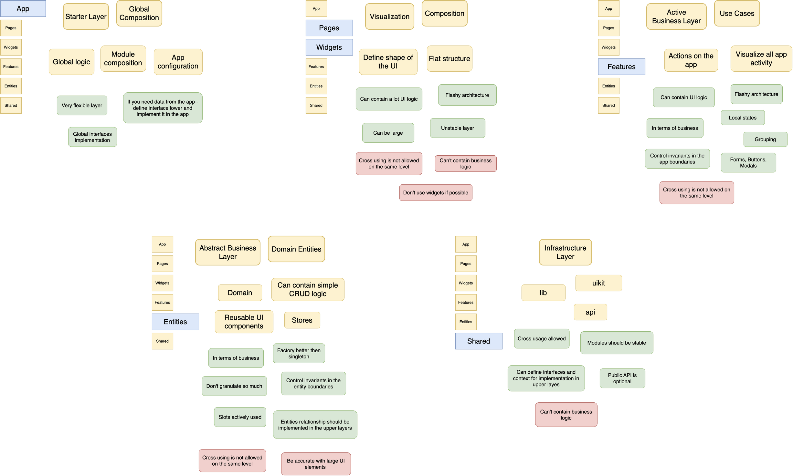

# eslint-plugin-vue-fsd

[](https://github.com/andrewmolyuk/eslint-plugin-vue-fsd/actions/workflows/release.yml)
[](https://app.codacy.com/gh/andrewmolyuk/eslint-plugin-vue-fsd/dashboard?utm_source=gh&utm_medium=referral&utm_content=&utm_campaign=Badge_grade)
[](https://app.codacy.com/gh/andrewmolyuk/eslint-plugin-vue-fsd/dashboard?utm_source=gh&utm_medium=referral&utm_content=&utm_campaign=Badge_coverage)
[](https://github.com/andrewmolyuk/eslint-plugin-vue-fsd/issues)
[](https://www.npmjs.com/package/eslint-plugin-vue-fsd)
[](https://github.com/semantic-release/semantic-release)

A custom ESLint plugin for enforcing FSD patterns in Vue projects.

> [!NOTE]
> The project is in active development and may have breaking changes in minor versions, but we will strive to keep changes minimal and well-documented.



## Features

- Enforces FSD (Feature-Sliced Design) architecture patterns in Vue.js projects.
- Provides a set of rules and guidelines for structuring Vue components and their interactions.
- Enforces consistent ordering of Vue Single File Component sections.
- Includes a set of predefined configurations for different project setups.
- Maintains 100% test coverage for reliability and quality assurance.

## Installation

```bash
npm install eslint-plugin-vue-fsd --save-dev
```

## Usage

We provide two predefined configurations to help enforce FSD principles in your Vue.js projects.

- recommended - enables the rules that recommended best practices for FSD and Vue.js development.
- all - enables all of the rules shipped with eslint-plugin-vue-fsd.

Eslint v9+ configuration (Recommended):

```javascript
import vueFsdPlugin from 'eslint-plugin-vue-fsd'

// .eslintrc.js
module.exports = {
  ...vueFsdPlugin.configs.recommended,
}
```

Legacy Eslint v8 configuration:

```javascript
import vueFsdPlugin from 'eslint-plugin-vue-fsd'

// .eslintrc.js
module.exports = {
  extends: ['plugin:vue-fsd/legacy/recommended'],
}
```

## Rules

The plugin provides the rules to enforce [Feature-Sliced Design](https://feature-sliced.design/) principles in [Vue.js](https://vuejs.org/) projects.

| Rule                                                     | Description                                                               |
| -------------------------------------------------------- | ------------------------------------------------------------------------- |
| [no-processes-layer](./docs/rules/no-processes-layer.md) | Ensure deprecated processes layer is not used.                            |
| [sfc-sections-order](./docs/rules/sfc-sections-order.md) | Enforce consistent order of top-level sections in single-file components. |

## Roadmap

As the plugin evolves, we plan to implement the following rules:

- no-higher-level-imports: Forbid imports from higher layers.
- no-cross-slice-imports: Forbid cross-imports between slices on the same layer.
- no-layer-public-api: Forbid exposing public APIs from a layer.
- no-segments-without-slices: Forbid segments without slices.
- public-api: Enforce consistent public API on slices.
- no-ui-in-app: Forbid using UI segment in the app layer.
- no-direct-imports: Forbid direct imports from outside the slice.
- slice-relative-path: Imports within one slice should be relative.
- slice-naming: Enforce consistent naming conventions for slices.
- composables-naming: Enforce consistent naming conventions for composables.
- components-naming: Enforce consistent naming conventions for components.
- no-orphaned-files: Forbid orphaned files that are not part of any slice.

We are always open to suggestions and contributions for new rules and improvements.

## Contribution

Pull requests and issues are welcome! Please follow the code style and add tests for new rules.

## License

MIT, see [LICENSE](./LICENSE) for details.
